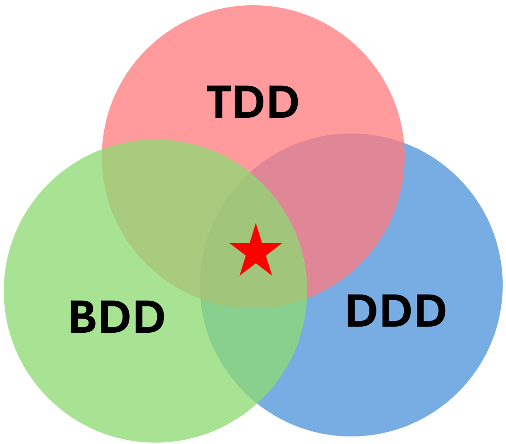

## [백엔드] Spring기반 테스트 (테스트 개요와 개발 패러다임)

1. 테스트 개요와 개발 패러다임
테스트 정의
소프트웨어가 예상대로 동작하는지 검증하는 과정
버그를 찾아내고, 품질을 보장하는 활동
요구사항 충족 여부를 확인하는 절차
테스트의 역할과 중요성
버그의 조기 발견으로 비용 절감
안정적인 리팩토링 가능
문서화 역할 (테스트 코드 자체가 명세가 됨)
설계 개선 유도
QA vs 개발자 테스트의 차이
QA 테스트: 사용자 관점의 블랙박스 테스트, 수동 테스트 위주
개발자 테스트: 코드 레벨의 화이트박스 테스트, 자동화 테스트 위주
화이트박스(White Box)

내부 구조·동작 보임
소스코드/로직을 알고 테스트
장점: 정확한 원인 분석, 내부 오류 발견
단점: 내부 지식 필요
블랙박스(Black Box)

내부 구조 안 보임
입력 → 출력만 보고 테스트
장점: 사용자 관점, 간단
단점: 내부 오류 원인 파악 어려움
테스트의 분류
1. 단위 테스트 (Unit Test)

가장 작은 테스트 단위
메서드/클래스 단위 테스트
빠른 실행과 즉각적인 피드백
2. 통합 테스트 (Integration Test)

여러 모듈의 상호작용 테스트
DB, 외부 API 등과의 통합 검증
3. 시스템 테스트

전체 시스템 동작 검증
End-to-End 테스트
4. 인수 테스트

사용자 요구사항 충족 여부 확인
실제 운영 환경과 유사한 조건에서 테스트
👉 단위 & 통합 테스트 연습해보기

1. TDD (Test-Driven Development)
개념과 원리
테스트 코드를 먼저 작성하고 구현하는 개발 방법론
Red → Green → Refactor 사이클로 진행
Red: 실패하는 테스트 작성
Green: 테스트를 통과하는 최소한의 코드 구현
Refactor: 코드 개선 및 중복 제거
예시 코드

// Red 단계: 실패하는 테스트 작성
@Test
void calculateDiscountTest() {
    Order order = new Order(10000);
    assertEquals(1000, order.calculateDiscount());  // 실패
}

// Green 단계: 구현
public class Order {
    private int amount;

    public Order(int amount) {
        this.amount = amount;
    }

    public int calculateDiscount() {
        return amount * 10 / 100;
    }
}

// Refactor 단계: 개선
public int calculateDiscount() {
    final int DISCOUNT_RATE = 10;
    return amount * DISCOUNT_RATE / 100;
}
장단점
장점:
견고한 설계와 구현
빠른 피드백
회귀 테스트 보장
과도한 구현 방지
단점:
초기 학습 곡선
개발 시간 증가
모든 상황에 적합하지 않음
2. BDD (Behavior-Driven Development)
TDD와의 차이점
TDD는 값(Value) 중심, BDD는 행위(Behavior) 중심
BDD는 비즈니스 요구사항을 더 명확하게 표현
도메인 전문가와 개발자 간 소통 도구로 활용
Given-When-Then 패턴
@Test
void userPurchaseScenarioTest() {
    // Given (준비)
    User user = new User("John");
    Product product = new Product("Phone", 1000000);

    // When (실행)
    Order order = user.purchase(product);

    // Then (검증)
    assertAll(
        () -> assertEquals(OrderStatus.PENDING, order.getStatus()),
        () -> assertEquals(1000000, order.getTotalAmount()),
        () -> assertEquals(user, order.getUser())
    );
}
3. DDD (Domain-Driven Design)
도메인 중심 설계
비즈니스 도메인을 중심으로 설계
탑다운 방식의 설계
도메인 모델과 비즈니스 로직의 일치
테스트와의 연관성
@Test
void domainLogicTest() {
    // 도메인 객체
    Account account = new Account("123-456", 10000);

    // 도메인 로직 실행
    account.withdraw(3000);

    // 도메인 규칙 검증
    assertAll(
        () -> assertEquals(7000, account.getBalance()),
        () -> assertTrue(account.getTransactions().size() > 0),
        () -> assertEquals(TransactionType.WITHDRAWAL,
                         account.getLastTransaction().getType())
    );
}
TDD/BDD/DDD의 관계와 상호 보완성
상호 보완적 관계
TDD: 테스트 주도 개발로 품질 보장
BDD: 비즈니스 요구사항의 명확한 표현
DDD: 도메인 중심의 설계와 구현
실무 적용 전략
도메인 복잡도에 따른 적절한 방법론 선택
팀의 역량과 프로젝트 특성 고려
점진적인 도입과 적용
지속적인 피드백과 개선
이러한 방법론들을 적절히 조합하여 사용하면 더 견고하고 유지보수가 용이한 소프트웨어 개발
